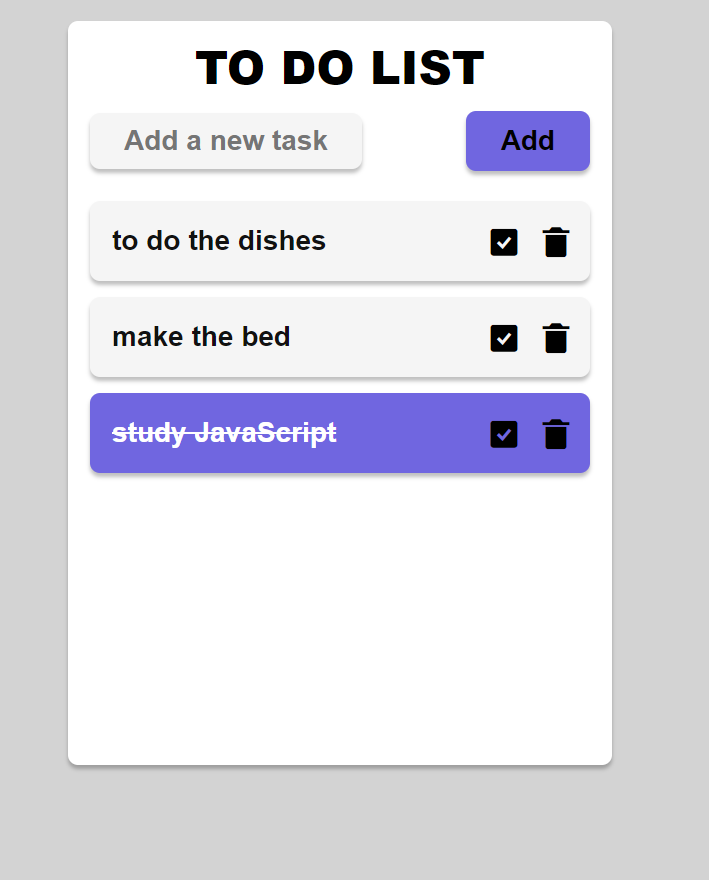

## **`To-Do List with React and Styled Components`**

This is a simple **to-do list** app created with **React** and **Styled Components**.

  

### `How to use`

To add a new task, type the task text into the input field click the "Add" button. To mark a task as completed, click the checkbox next to it. To remove a task, click the trash button next to it.

## Deployment

The To-do List application is deployed on [**VERCEL**](https://web-notices.vercel.app/), ensuring a seamless and efficient user experience.
